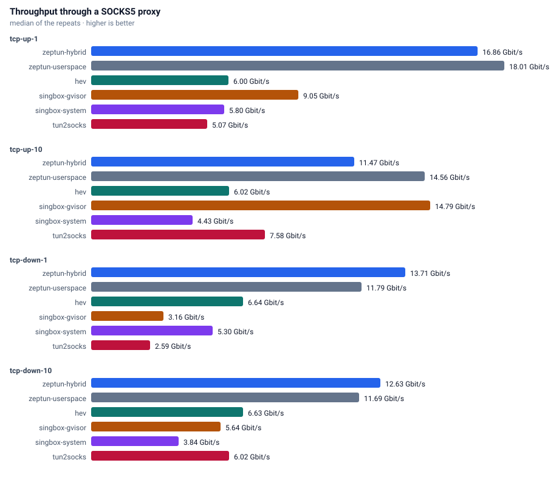
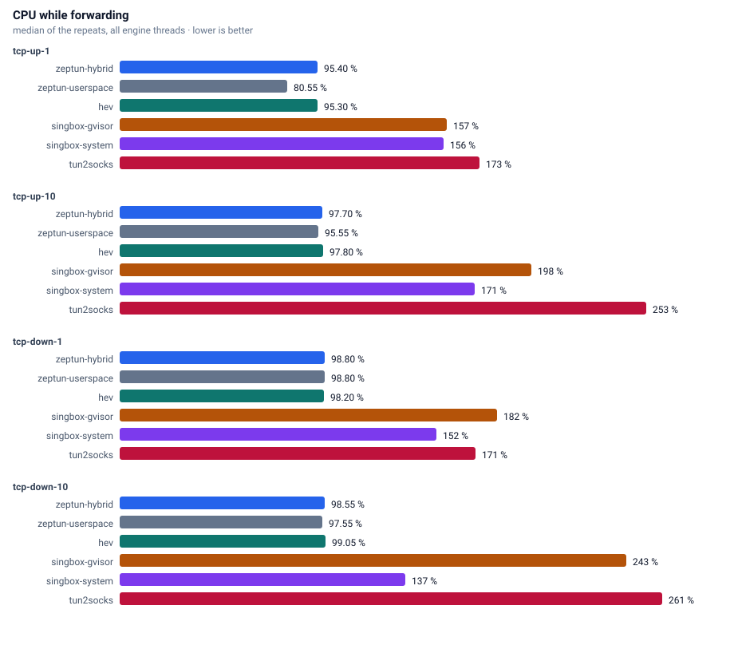
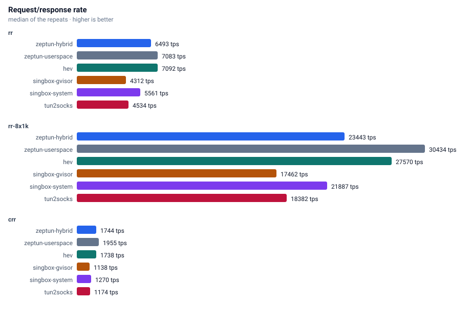
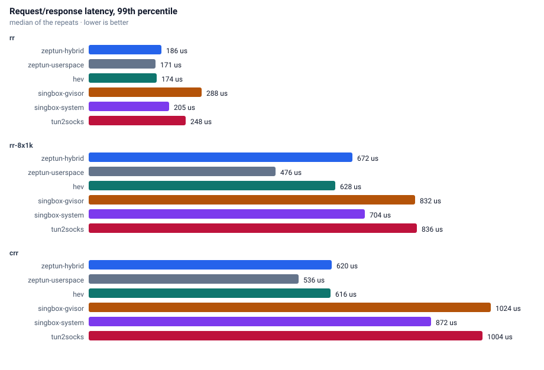
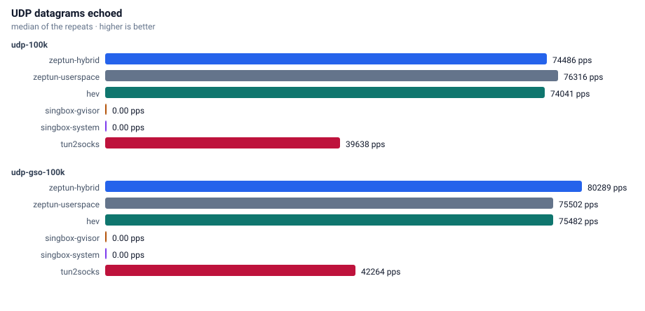
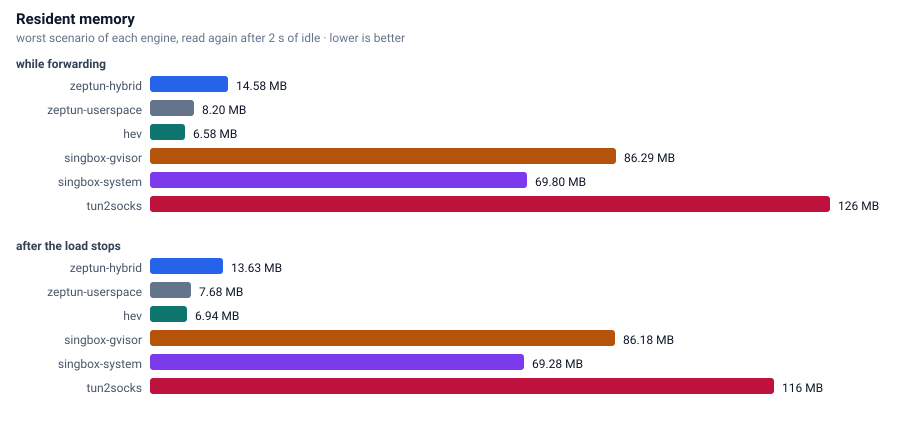

# Benchmarks

Every number on this page comes from the `benchmark` workflow in this repository, run on a GitHub-hosted runner.

## Machine

| property | value |
|---|---|
| runner image | ubuntu24 20260920.314.1 |
| cpu | AMD EPYC 7763 64-Core Processor |
| cpu cores | 4 |
| memory | 15.6 GB |
| kernel | Linux 6.17.0-1022-azure |
| zig | 0.16.0 |
| date | 2026-09-27 |

## Method

Two network namespaces joined by a veth pair. Traffic enters the tunnel device (MTU 8500), leaves through the same SOCKS5 server (hev-socks5-server) for every engine, and reaches the servers in the second namespace. CPU comes from `/proc/<pid>/stat` and memory from `VmRSS`, summed over all processes of an engine.

Results are produced in two tiers and never mixed in one table. The fair tier runs every engine on a single TUN queue. The multi queue tier runs only the engines that can attach more than one queue. The queue count actually granted by the kernel is read back from `/sys/class/net/<dev>/queues` and printed in the capability table, so an engine that silently got fewer queues than requested is visible instead of being compared as if it had them.

Each engine is started once per round, warmed up with a discarded transfer, and then measured on every scenario. The order of engines is rotated each round so a systematic position in the round cannot favour the first engine. Duration 4 s per scenario, 2 rounds. Memory is read twice: the highest sample while the scenario runs, and again after 2 s of idle, which shows whether an engine gives the memory back.

## Throughput

## CPU

## Request/response

## UDP

## Memory

## Raw results

| engine | multiqueue | queues requested | queues actual | processes |
|---|---|---:|---:|---:|
| hev | yes | 1 | 1 | 1 |
| singbox-gvisor | no | 1 | 1 | 1 |
| singbox-system | no | 1 | 1 | 1 |
| tun2socks | no | 1 | 1 | 1 |
| zeptun-hybrid | yes | 1 | 1 | 1 |
| zeptun-userspace | yes | 1 | 1 | 1 |
# Benchmark results

Engines are grouped by the number of TUN queues they actually received, so a
single-queue engine is never compared against a multi-queue engine inside one table.

> Only 2 round(s) per cell; treat differences under ~10% as noise.

## TUN queues: 1

| engine | scenario | median | rounds | spread | cpu % | max rss MB | rss after idle MB |
|---|---|---:|---:|---:|---:|---:|---:|
| hev | crr | 1744 tps p50=560us p99=656us p99.9=928us | 2 | 0.9% | 56 | 3.9 | 3.8 |
| hev | rr | 7401 tps p50=130us p99=174us p99.9=194us | 2 | 3.8% | 39 | 3.9 | 3.8 |
| hev | rr-8x1k | 27666 tps p50=268us p99=632us p99.9=944us | 2 | 3.2% | 89 | 4.4 | 3.8 |
| hev | tcp-down-1 | 6.993 | 2 | 7.0% | 98 | 4.0 | 3.8 |
| hev | tcp-down-10 | 6.720 | 2 | 1.1% | 99 | 4.7 | 3.8 |
| hev | tcp-up-1 | 5.771 | 2 | 1.3% | 95 | 4.0 | 3.8 |
| hev | tcp-up-10 | 6.354 | 2 | 2.6% | 98 | 5.1 | 3.8 |
| hev | udp-100k | 78182 echo pps (78.2% of 100000 sent) | 2 | 4.2% | 99 | 6.6 | 6.6 |
| hev | udp-gso-100k | 76453 echo pps (76.5% of 99975 sent) | 2 | 0.5% | 99 | 6.6 | 6.6 |
| singbox-gvisor | crr | 1146 tps p50=848us p99=1024us p99.9=1824us | 2 | 0.3% | 104 | 85.8 | 86.4 |
| singbox-gvisor | rr | 4384 tps p50=226us p99=284us p99.9=356us | 2 | 0.6% | 81 | 87.2 | 85.9 |
| singbox-gvisor | rr-8x1k | 17724 tps p50=432us p99=832us p99.9=1168us | 2 | 0.8% | 169 | 86.3 | 86.2 |
| singbox-gvisor | tcp-down-1 | 3.207 | 2 | 1.0% | 182 | 82.4 | 72.7 |
| singbox-gvisor | tcp-down-10 | 5.641 | 2 | 0.8% | 243 | 87.2 | 87.2 |
| singbox-gvisor | tcp-up-1 | 9.306 | 2 | 1.2% | 157 | 72.2 | 71.8 |
| singbox-gvisor | tcp-up-10 | 14.956 | 2 | 1.4% | 198 | 80.8 | 80.8 |
| singbox-gvisor | udp-100k | 0 echo pps (0.0% of 99984 sent) | 2 | 0.0% | 172 | 86.4 | 86.1 |
| singbox-gvisor | udp-gso-100k | 0 | 2 | 0.0% | 0 | 86.1 | 86.1 |
| singbox-system | crr | 1267 tps p50=776us p99=896us p99.9=1536us | 2 | 0.1% | 101 | 70.6 | 70.6 |
| singbox-system | rr | 5586 tps p50=174us p99=218us p99.9=242us | 2 | 1.6% | 62 | 62.0 | 62.0 |
| singbox-system | rr-8x1k | 21848 tps p50=348us p99=704us p99.9=1024us | 2 | 1.2% | 154 | 62.0 | 62.0 |
| singbox-system | tcp-down-1 | 5.613 | 2 | 2.9% | 152 | 62.1 | 61.7 |
| singbox-system | tcp-down-10 | 3.883 | 2 | 1.6% | 137 | 62.5 | 62.5 |
| singbox-system | tcp-up-1 | 6.059 | 2 | 3.4% | 156 | 61.9 | 61.8 |
| singbox-system | tcp-up-10 | 4.637 | 2 | 2.0% | 171 | 61.9 | 61.9 |
| singbox-system | udp-100k | 0 echo pps (0.0% of 99967 sent) | 2 | 0.0% | 87 | 70.9 | 70.8 |
| singbox-system | udp-gso-100k | 0 echo pps (0.0% of 99984 sent) | 2 | 0.0% | 76 | 70.8 | 70.5 |
| tun2socks | crr | 1188 tps p50=816us p99=1016us p99.9=2240us | 2 | 0.4% | 91 | 125.9 | 54.1 |
| tun2socks | rr | 4600 tps p50=216us p99=260us p99.9=328us | 2 | 0.1% | 74 | 105.4 | 105.4 |
| tun2socks | rr-8x1k | 18453 tps p50=412us p99=848us p99.9=1168us | 2 | 0.1% | 167 | 113.8 | 113.8 |
| tun2socks | tcp-down-1 | 2.612 | 2 | 0.0% | 171 | 42.0 | 23.5 |
| tun2socks | tcp-down-10 | 6.143 | 2 | 1.8% | 261 | 103.3 | 103.3 |
| tun2socks | tcp-up-1 | 5.112 | 2 | 0.6% | 173 | 23.5 | 21.6 |
| tun2socks | tcp-up-10 | 7.716 | 2 | 3.8% | 253 | 38.3 | 38.3 |
| tun2socks | udp-100k | 39263 echo pps (39.3% of 99920 sent) | 2 | 0.2% | 217 | 42.9 | 39.2 |
| tun2socks | udp-gso-100k | 42859 echo pps (42.9% of 99975 sent) | 2 | 2.5% | 231 | 56.2 | 56.2 |
| zeptun-hybrid | crr | 1748 tps p50=560us p99=640us p99.9=848us | 2 | 0.4% | 55 | 11.8 | 11.7 |
| zeptun-hybrid | rr | 6494 tps p50=148us p99=198us p99.9=392us | 2 | 3.4% | 41 | 7.3 | 7.2 |
| zeptun-hybrid | rr-8x1k | 24034 tps p50=320us p99=664us p99.9=1088us | 2 | 4.4% | 96 | 7.3 | 7.2 |
| zeptun-hybrid | tcp-down-1 | 14.135 | 2 | 6.0% | 99 | 8.9 | 7.3 |
| zeptun-hybrid | tcp-down-10 | 12.962 | 2 | 0.5% | 99 | 8.9 | 7.3 |
| zeptun-hybrid | tcp-up-1 | 17.253 | 2 | 10.5% | 95 | 8.8 | 7.2 |
| zeptun-hybrid | tcp-up-10 | 11.681 | 2 | 0.8% | 98 | 8.9 | 7.3 |
| zeptun-hybrid | udp-100k | 80047 echo pps (80.1% of 99984 sent) | 2 | 2.3% | 73 | 14.7 | 13.9 |
| zeptun-hybrid | udp-gso-100k | 78217 echo pps (78.2% of 99976 sent) | 2 | 2.4% | 54 | 14.8 | 13.8 |
| zeptun-userspace | crr | 1972 tps p50=492us p99=560us p99.9=656us | 2 | 0.9% | 42 | 4.3 | 4.3 |
| zeptun-userspace | rr | 7194 tps p50=132us p99=180us p99.9=202us | 2 | 2.0% | 35 | 3.5 | 3.4 |
| zeptun-userspace | rr-8x1k | 30181 tps p50=254us p99=492us p99.9=640us | 2 | 4.5% | 78 | 3.5 | 3.5 |
| zeptun-userspace | tcp-down-1 | 11.580 | 2 | 0.5% | 99 | 3.5 | 3.4 |
| zeptun-userspace | tcp-down-10 | 11.889 | 2 | 1.9% | 98 | 6.1 | 6.0 |
| zeptun-userspace | tcp-up-1 | 18.505 | 2 | 0.5% | 81 | 5.0 | 3.3 |
| zeptun-userspace | tcp-up-10 | 14.529 | 2 | 0.3% | 96 | 6.0 | 3.4 |
| zeptun-userspace | udp-100k | 77788 echo pps (77.8% of 99992 sent) | 2 | 0.7% | 72 | 5.2 | 4.3 |
| zeptun-userspace | udp-gso-100k | 77570 echo pps (77.6% of 99984 sent) | 2 | 0.9% | 54 | 5.2 | 5.2 |

## Throughput by engine (best tier each engine reached)

| engine | queues | scenario | median |
|---|---:|---|---:|
| hev | 1 | crr | 1744 tps p50=560us p99=656us p99.9=928us |
| hev | 1 | rr | 7401 tps p50=130us p99=174us p99.9=194us |
| hev | 1 | rr-8x1k | 27666 tps p50=268us p99=632us p99.9=944us |
| hev | 1 | tcp-down-1 | 6.993 |
| hev | 1 | tcp-down-10 | 6.720 |
| hev | 1 | tcp-up-1 | 5.771 |
| hev | 1 | tcp-up-10 | 6.354 |
| hev | 1 | udp-100k | 78182 echo pps (78.2% of 100000 sent) |
| hev | 1 | udp-gso-100k | 76453 echo pps (76.5% of 99975 sent) |
| singbox-gvisor | 1 | crr | 1146 tps p50=848us p99=1024us p99.9=1824us |
| singbox-gvisor | 1 | rr | 4384 tps p50=226us p99=284us p99.9=356us |
| singbox-gvisor | 1 | rr-8x1k | 17724 tps p50=432us p99=832us p99.9=1168us |
| singbox-gvisor | 1 | tcp-down-1 | 3.207 |
| singbox-gvisor | 1 | tcp-down-10 | 5.641 |
| singbox-gvisor | 1 | tcp-up-1 | 9.306 |
| singbox-gvisor | 1 | tcp-up-10 | 14.956 |
| singbox-gvisor | 1 | udp-100k | 0 echo pps (0.0% of 99984 sent) |
| singbox-gvisor | 1 | udp-gso-100k | 0 |
| singbox-system | 1 | crr | 1267 tps p50=776us p99=896us p99.9=1536us |
| singbox-system | 1 | rr | 5586 tps p50=174us p99=218us p99.9=242us |
| singbox-system | 1 | rr-8x1k | 21848 tps p50=348us p99=704us p99.9=1024us |
| singbox-system | 1 | tcp-down-1 | 5.613 |
| singbox-system | 1 | tcp-down-10 | 3.883 |
| singbox-system | 1 | tcp-up-1 | 6.059 |
| singbox-system | 1 | tcp-up-10 | 4.637 |
| singbox-system | 1 | udp-100k | 0 echo pps (0.0% of 99967 sent) |
| singbox-system | 1 | udp-gso-100k | 0 echo pps (0.0% of 99984 sent) |
| tun2socks | 1 | crr | 1188 tps p50=816us p99=1016us p99.9=2240us |
| tun2socks | 1 | rr | 4600 tps p50=216us p99=260us p99.9=328us |
| tun2socks | 1 | rr-8x1k | 18453 tps p50=412us p99=848us p99.9=1168us |
| tun2socks | 1 | tcp-down-1 | 2.612 |
| tun2socks | 1 | tcp-down-10 | 6.143 |
| tun2socks | 1 | tcp-up-1 | 5.112 |
| tun2socks | 1 | tcp-up-10 | 7.716 |
| tun2socks | 1 | udp-100k | 39263 echo pps (39.3% of 99920 sent) |
| tun2socks | 1 | udp-gso-100k | 42859 echo pps (42.9% of 99975 sent) |
| zeptun-hybrid | 1 | crr | 1748 tps p50=560us p99=640us p99.9=848us |
| zeptun-hybrid | 1 | rr | 6494 tps p50=148us p99=198us p99.9=392us |
| zeptun-hybrid | 1 | rr-8x1k | 24034 tps p50=320us p99=664us p99.9=1088us |
| zeptun-hybrid | 1 | tcp-down-1 | 14.135 |
| zeptun-hybrid | 1 | tcp-down-10 | 12.962 |
| zeptun-hybrid | 1 | tcp-up-1 | 17.253 |
| zeptun-hybrid | 1 | tcp-up-10 | 11.681 |
| zeptun-hybrid | 1 | udp-100k | 80047 echo pps (80.1% of 99984 sent) |
| zeptun-hybrid | 1 | udp-gso-100k | 78217 echo pps (78.2% of 99976 sent) |
| zeptun-userspace | 1 | crr | 1972 tps p50=492us p99=560us p99.9=656us |
| zeptun-userspace | 1 | rr | 7194 tps p50=132us p99=180us p99.9=202us |
| zeptun-userspace | 1 | rr-8x1k | 30181 tps p50=254us p99=492us p99.9=640us |
| zeptun-userspace | 1 | tcp-down-1 | 11.580 |
| zeptun-userspace | 1 | tcp-down-10 | 11.889 |
| zeptun-userspace | 1 | tcp-up-1 | 18.505 |
| zeptun-userspace | 1 | tcp-up-10 | 14.529 |
| zeptun-userspace | 1 | udp-100k | 77788 echo pps (77.8% of 99992 sent) |
| zeptun-userspace | 1 | udp-gso-100k | 77570 echo pps (77.6% of 99984 sent) |

| engine | multiqueue | queues requested | queues actual | processes |
|---|---|---:|---:|---:|
| hev | yes | 4 | 1 | 4 |
| zeptun-hybrid | yes | 4 | 1 | 1 |
| zeptun-userspace | yes | 4 | 1 | 1 |
# Benchmark results

Engines are grouped by the number of TUN queues they actually received, so a
single-queue engine is never compared against a multi-queue engine inside one table.

> hev was asked for 4 queues but got 1.

> zeptun-hybrid was asked for 4 queues but got 1.

> zeptun-userspace was asked for 4 queues but got 1.

> Only 2 round(s) per cell; treat differences under ~10% as noise.

## TUN queues: 1

| engine | scenario | median | rounds | spread | cpu % | max rss MB | rss after idle MB |
|---|---|---:|---:|---:|---:|---:|---:|
| hev | crr | 1734 tps p50=560us p99=648us p99.9=744us | 2 | 0.6% | 65 | 15.5 | 15.2 |
| hev | rr | 6662 tps p50=146us p99=188us p99.9=212us | 2 | 0.0% | 40 | 15.3 | 15.2 |
| hev | rr-8x1k | 30820 tps p50=244us p99=520us p99.9=688us | 2 | 2.2% | 124 | 15.8 | 15.2 |
| hev | tcp-down-1 | 6.539 | 2 | 1.0% | 98 | 15.4 | 15.2 |
| hev | tcp-down-10 | 10.963 | 2 | 0.6% | 206 | 16.0 | 15.2 |
| hev | tcp-up-1 | 5.892 | 2 | 5.9% | 96 | 15.0 | 14.8 |
| hev | tcp-up-10 | 13.677 | 2 | 6.5% | 221 | 16.3 | 15.2 |
| hev | udp-100k | 75279 echo pps (75.3% of 99975 sent) | 2 | 0.9% | 99 | 17.9 | 19.3 |
| hev | udp-gso-100k | 73940 echo pps (74.0% of 99984 sent) | 2 | 0.1% | 98 | 22.0 | 22.0 |
| zeptun-hybrid | crr | 1531 tps p50=640us p99=752us p99.9=848us | 2 | 0.3% | 68 | 20.2 | 20.0 |
| zeptun-hybrid | rr | 6442 tps p50=152us p99=198us p99.9=224us | 2 | 0.3% | 40 | 10.9 | 10.6 |
| zeptun-hybrid | rr-8x1k | 28446 tps p50=264us p99=520us p99.9=672us | 2 | 1.5% | 137 | 10.6 | 10.3 |
| zeptun-hybrid | tcp-down-1 | 12.713 | 2 | 3.6% | 99 | 11.1 | 10.6 |
| zeptun-hybrid | tcp-down-10 | 21.854 | 2 | 1.8% | 193 | 11.6 | 10.9 |
| zeptun-hybrid | tcp-up-1 | 16.745 | 2 | 39.3% | 97 | 8.5 | 8.1 |
| zeptun-hybrid | tcp-up-10 | 20.176 | 2 | 6.5% | 154 | 11.5 | 10.8 |
| zeptun-hybrid | udp-100k | 81184 echo pps (81.2% of 99992 sent) | 2 | 1.3% | 97 | 22.5 | 22.1 |
| zeptun-hybrid | udp-gso-100k | 78876 echo pps (78.9% of 99992 sent) | 2 | 0.8% | 54 | 24.6 | 24.1 |
| zeptun-userspace | crr | 1906 tps p50=508us p99=592us p99.9=664us | 2 | 0.4% | 46 | 14.8 | 14.7 |
| zeptun-userspace | rr | 6755 tps p50=152us p99=186us p99.9=214us | 2 | 0.2% | 37 | 14.5 | 14.4 |
| zeptun-userspace | rr-8x1k | 33470 tps p50=224us p99=480us p99.9=648us | 2 | 6.6% | 103 | 14.5 | 14.4 |
| zeptun-userspace | tcp-down-1 | 11.711 | 2 | 8.9% | 97 | 10.1 | 10.1 |
| zeptun-userspace | tcp-down-10 | 19.457 | 2 | 1.0% | 172 | 18.2 | 14.4 |
| zeptun-userspace | tcp-up-1 | 18.571 | 2 | 2.2% | 83 | 12.8 | 9.8 |
| zeptun-userspace | tcp-up-10 | 20.061 | 2 | 0.2% | 123 | 15.0 | 9.8 |
| zeptun-userspace | udp-100k | 81215 echo pps (81.2% of 99967 sent) | 2 | 0.4% | 75 | 17.4 | 16.6 |
| zeptun-userspace | udp-gso-100k | 80052 echo pps (80.1% of 99967 sent) | 2 | 1.5% | 56 | 17.5 | 16.5 |

## Throughput by engine (best tier each engine reached)

| engine | queues | scenario | median |
|---|---:|---|---:|
| hev | 1 | crr | 1734 tps p50=560us p99=648us p99.9=744us |
| hev | 1 | rr | 6662 tps p50=146us p99=188us p99.9=212us |
| hev | 1 | rr-8x1k | 30820 tps p50=244us p99=520us p99.9=688us |
| hev | 1 | tcp-down-1 | 6.539 |
| hev | 1 | tcp-down-10 | 10.963 |
| hev | 1 | tcp-up-1 | 5.892 |
| hev | 1 | tcp-up-10 | 13.677 |
| hev | 1 | udp-100k | 75279 echo pps (75.3% of 99975 sent) |
| hev | 1 | udp-gso-100k | 73940 echo pps (74.0% of 99984 sent) |
| zeptun-hybrid | 1 | crr | 1531 tps p50=640us p99=752us p99.9=848us |
| zeptun-hybrid | 1 | rr | 6442 tps p50=152us p99=198us p99.9=224us |
| zeptun-hybrid | 1 | rr-8x1k | 28446 tps p50=264us p99=520us p99.9=672us |
| zeptun-hybrid | 1 | tcp-down-1 | 12.713 |
| zeptun-hybrid | 1 | tcp-down-10 | 21.854 |
| zeptun-hybrid | 1 | tcp-up-1 | 16.745 |
| zeptun-hybrid | 1 | tcp-up-10 | 20.176 |
| zeptun-hybrid | 1 | udp-100k | 81184 echo pps (81.2% of 99992 sent) |
| zeptun-hybrid | 1 | udp-gso-100k | 78876 echo pps (78.9% of 99992 sent) |
| zeptun-userspace | 1 | crr | 1906 tps p50=508us p99=592us p99.9=664us |
| zeptun-userspace | 1 | rr | 6755 tps p50=152us p99=186us p99.9=214us |
| zeptun-userspace | 1 | rr-8x1k | 33470 tps p50=224us p99=480us p99.9=648us |
| zeptun-userspace | 1 | tcp-down-1 | 11.711 |
| zeptun-userspace | 1 | tcp-down-10 | 19.457 |
| zeptun-userspace | 1 | tcp-up-1 | 18.571 |
| zeptun-userspace | 1 | tcp-up-10 | 20.061 |
| zeptun-userspace | 1 | udp-100k | 81215 echo pps (81.2% of 99967 sent) |
| zeptun-userspace | 1 | udp-gso-100k | 80052 echo pps (80.1% of 99967 sent) |

zeptun: startup 4 ms, idle 840 KB, 5 wakeups in 20 s | tcp 1000: 9700 KB (conns: 1000/1000 established, 0 failed, 1881 conn/s) | udp 1000: 4236 KB (udp flows: 1000/1000 answered, 9122 flows/s)
hev: startup 3 ms, idle 2225 KB, 2 wakeups in 20 s | tcp 1000: 78794 KB (conns: 1000/1000 established, 0 failed, 1890 conn/s) | udp 1000: 27314 KB (udp flows: 1000/1000 answered, 7194 flows/s)
singbox-system: startup 49 ms, idle 59789 KB, 6 wakeups in 20 s | tcp 1000: 73784 KB (conns: 1000/1000 established, 0 failed, 1327 conn/s) | udp 1000: 71284 KB (udp flows: 0/1000 answered, 0 flows/s)
singbox-gvisor: startup 50 ms, idle 61733 KB, 123 wakeups in 20 s | tcp 1000: 96632 KB (conns: 1000/1000 established, 0 failed, 1241 conn/s) | udp 1000: 102804 KB (udp flows: 0/1000 answered, 0 flows/s)
tun2socks: startup 5 ms, idle 15832 KB, 258 wakeups in 20 s | tcp 1000: 111308 KB (conns: 1000/1000 established, 0 failed, 1205 conn/s) | udp 1000: 183852 KB (udp flows: 1000/1000 answered, 6192 flows/s)
